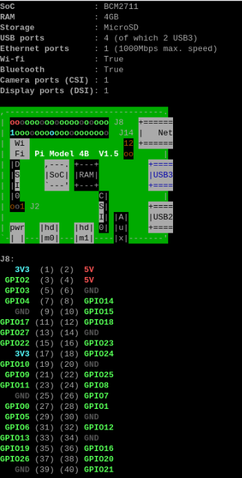

# PL5 - Exercício II: Kernel Module Blinker (Raspberry Pi 4)

* blinker-rpi4.c
* Programa referente à ficha PL5 – Exercício II
* Implementação de um Loadable Kernel Module (LKM) com timer para controlo do estado de um GPIO no Raspberry Pi 4
* Permite leitura e escrita do período de comutação através de um character device (/dev/blinker)
* Created: 11/04/2026
* Author : Ines Santos (1140623), André Pinto (1200209) e Gabriel Lopes (1252630)

## PINOUT



## Objetivo

Desenvolver um módulo de kernel para o Raspberry Pi 4 capaz de controlar um LED através de um GPIO, permitindo configurar dinamicamente o período de blinking via interface `/dev/blinker`.

---

## Arquitetura

O sistema está dividido em duas partes:

### Kernel Space

* Timer do kernel (`hrtimer`)
* Controlo direto do GPIO
* Driver com funções:

  * `init` → inicialização
  * `read` → leitura do período
  * `write` → alteração do período

### User Space

* Interface através de:

  * `/dev/blinker`
* Interação via comandos Linux (`cat`, `echo`, `tee`)

---

## Ficheiros principais

* `blinker.c` → lógica principal do driver
* `gpio.c / gpio.h` → abstração do GPIO
* `Makefile` → compilação do módulo
* `blinker-rpi4.ko` → módulo gerado

---

## GPIO Utilizados

Foram utilizados os seguintes pinos do Raspberry Pi (numeração física):

- Pino 32 → GPIO12 
- Pino 30 → GND 

A escolha primeiramente seguiu o setup realizado em aula, garantindo consistência entre ambiente de desenvolvimento e testes.

Na aula O LED estava ligado:
- GPIO4 (pino 7) → resistência → LED → GND

DEPOIS MUDOU SE
- GPIO12 (pino32) -> resistencia -> LED -> GND
---

## Compilação

```bash
make
```
---

## Execução

### Carregar módulo

```bash
sudo insmod blinker-rpi4.ko
```

### Ver logs do kernel

```bash
dmesg -W
```

---

## Interface `/dev/blinker`

### READ (ler período atual)

```bash
sudo cat /dev/blinker
```

---
## Hardware

* Raspberry Pi 4
* LED
* Resistência (~220–330Ω)
* GPIO12 (output)
* GND comum

---

## Notas Importantes

Conclusão:
O comportamento do LED (apagado, fixo, a piscar) foi utilizado como principal ferramenta de debugging, permitindo validar o funcionamento do driver ao nível do hardware.

## Conclusão

O módulo permite:

* controlo dinâmico do período de blinking
* comunicação entre user space e kernel space
* validação prática de drivers Linux com GPIO

✔ Exercício concluído com sucesso

---
