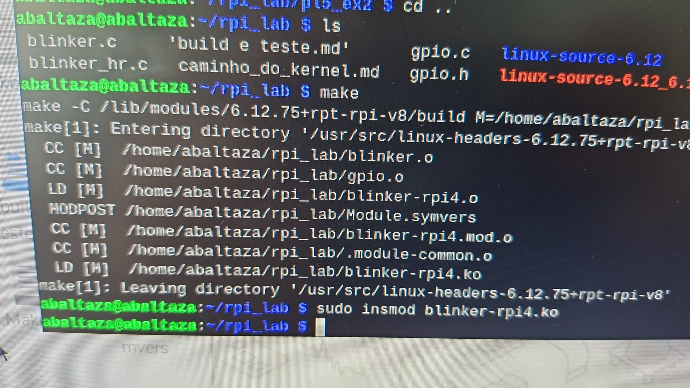
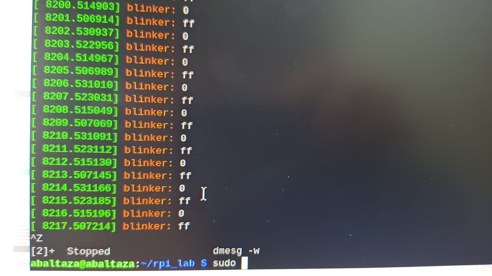
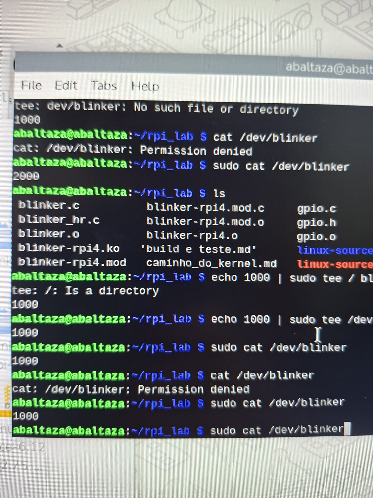
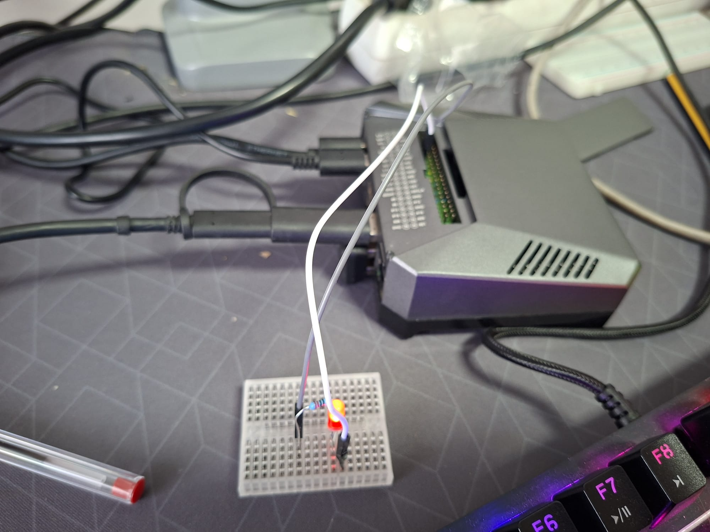
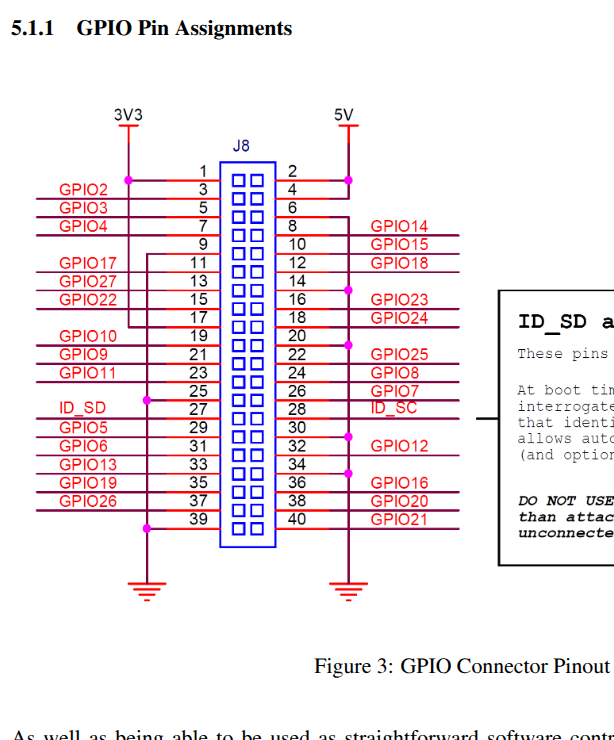

fotos do setup:

    led a piscar

     

**READ**

    sudo cat /dev/blinker

2000

**WRITE**

    echo 1000 | sudo tee /dev/blinker

1000

    cat /dev/blinker

2000

    SETUP 

pinout raspberry

video do exercicio com led a piscar 
"whatsApp Video" 

LER A README.md